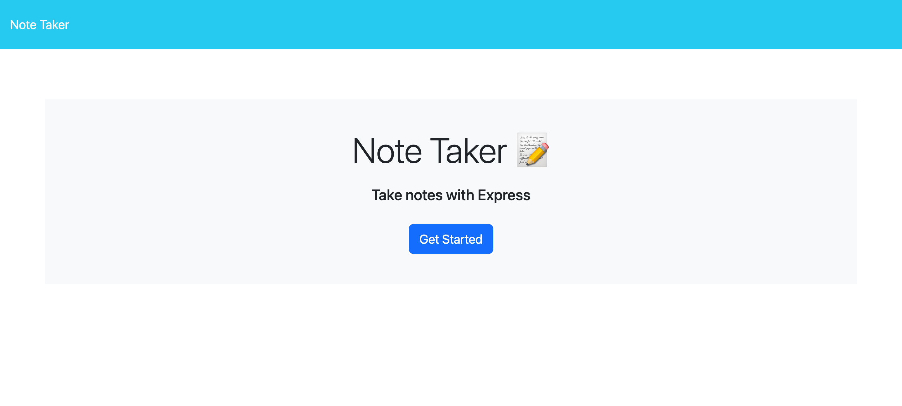
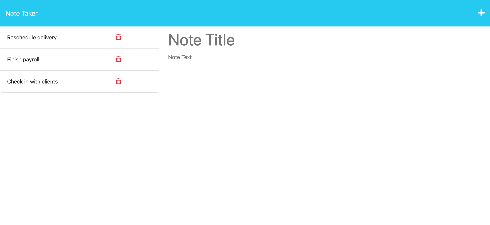

# bucks-note-taker

---

## Table of Contents

- [Description](#Description)
- [Website Link](#website-link)
- [Screen Shots](#screen-shots)
- [Installation](#installation)
- [Usage](#usage)
- [Contributing](#Contributing)

---

## Description

```
I created a note taker application that accepts user input infromation. It can be used to write and save notes. The app uses an Express.js back end and will save and retrieve user generated note data from a JSON file. The application’s front end has already been created. I built the back end, connected the two, and then deploy the finished application to Heroku.
```

---

## Website Link

Check out the deployed app here: [Note Taker](https://salty-gorge-36612.herokuapp.com/)

---

## Screen Shots





---

## Installation

💾

In the command line run `npm install` to install [Express.js](https://expressjs.com/)

---

## Usage

💻

Type `npm run start` in the command line

---

## Contributing

[Buck Blocker](https://github.com/bucknorris336)

[def]: #license
